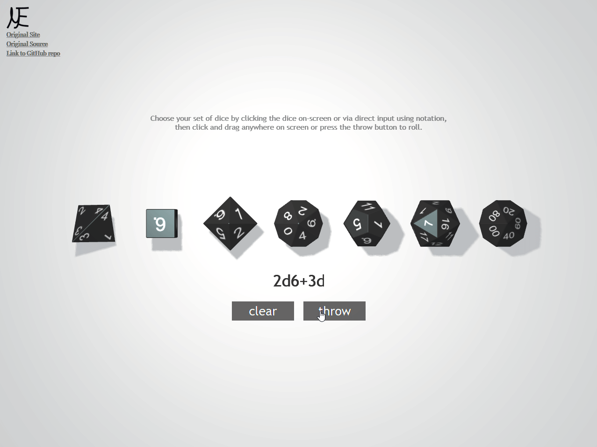

# Interactive 3D Dice Roller
##### Sourced from [a.teal.info/dice](https://a.teal.info/dice)

An online, interactive 3D dice roller that utlilises `three.js` and `cannon.js`. Using the API provided by [random.org](https://random.org), generates truly random rolls for any combination of d4, d6, d8, d10, d12, d20 and d100. The physics seen on-screen is merely for show - all values are derived from atmospheric noise.

### Usage

#### URL Parameters

There are several parameters that can be passed into the URL. To use a parameter, the syntax is `matteas.nz/dice-roller?<param>[=<value>]`

##### Color
By adding `color=<color>` to the URL, you can change the colour of the dice. Without this parameter specified, the default is black. The currently supported colours are:

- White (#808080)
- Blue (#1883db)
- Red (#d10e00)
- Green (#008a17)
- Orange (#fc7b03)
- Purple (#7d0099)
- Brown (#593304)

##### Notation

By adding `notation=<notation>` to the URL, you can set the dice roll to be executed. This is useful when you want to know the result of a very specific dice roll without needing to first input that roll on the site. Note that `roll` is still needed to roll the dice without pressing the button on the site. This project uses the standard dice notation which you can read more about [here](https://en.wikipedia.org/wiki/Dice_notation). Some examples:

| Notation | Result |
| -------- | ------ |
| 1d6      | A single 6-sided die |
| 2d10     | Two 10-sided die |
| 1d8 + 1d20 | A single 8-sided die and a single 20-sided die |

##### Roll

By adding `roll` to the URL, you can intiate a rolling of dice directly without
the need to press the button on the site. There is no value associated with
this parameter, so the usage is simply `matteas.nz/dice-roller?roll`.

##### Shadows

To disable the rendering of shadows for rolled dice, add `shadows=0` to the URL. Note that this does not affect the shadows on the selection screen, only the shadows present during the rolling of dice.

### Demo

### License

*Interactive 3D Dice Roller* is licensed under the MIT License.

### Copyright

All rights to the original code belong to [Anton Naratov](http://www.teall.info/). This project merely builds upon his work.
